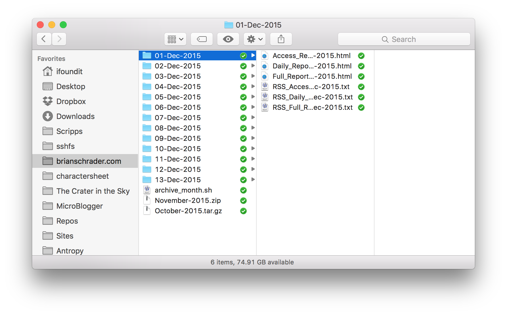

slug: removing-google-analytics
published: Sat, 19 Dec 2015 at 03:37 PM
updated: Thu, 12 Sep 2024 00:35:15 
title: Removing Google Analytics
author: Brian Schrader
tags: google analytics
status: publish

Today, I removed Google Analytics from this site. I've been
debating this for a while now, ever since the [discussion of ad tracking that
came with the release of iOS 9][0]. I think it's unfair that I use Google 
Analytics to track visitors to this site but that I also block GA on my
machine.

During that whole discussion, I went looking for alternatives, and I've been
using [GoAccess][1] for a few months now in parallel with Google Analytics. 
Overall I'd say the results are vaguely comparable. GoAccess gives me higher 
overall numbers for pageviews and visitor counts, but that's a consequence of it
running on the server and seeing the effects of browser pre-fetching. 

Every night a custom script runs the numbers and spits out a directory with a 
few different reports for that day, and that week so far. It's a good system, 
and although it doesn't have the cool real-time features of Google Analytics, 
I found that that actually keeps me from constantly checking the traffic when 
I'm supposed to be doing something else. Although, GoAccess does have a live 
traffic CLI interface if I really need it.

[0]: http://brianschrader.com/archive/re-the-ethics-of-modern-web-ad-blocking/ 
[1]: http://goaccess.io
